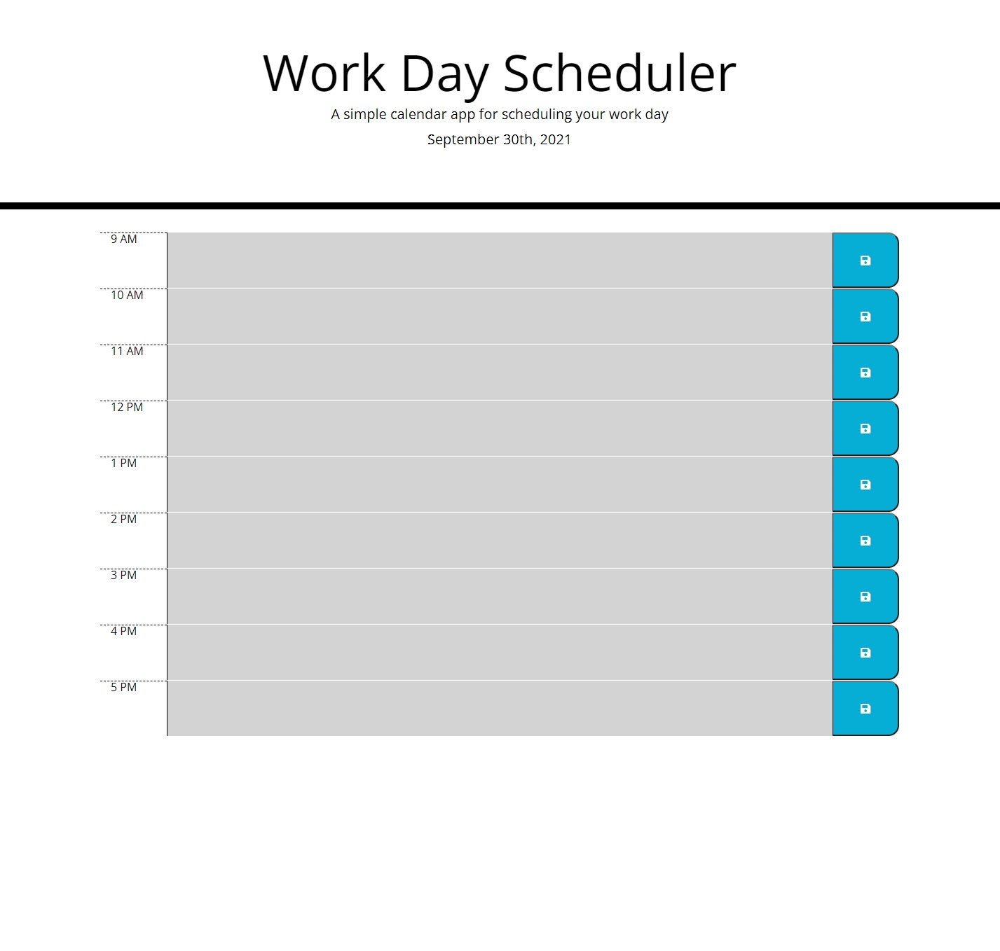

# Work Day Scheduler

This is a work day scheduler that shows the user the regular nine to five. On the header, the date will changed based on current time. The user is able to write in the text area of each work hour. Based on the current time, the text area will change colors. It will turn to gray if the time had already passed, red if it's the current hour, and green if the time is in the future. Once you have text in the text area, you can save the text. If you refresh the page the text will still remain.

## Getting Started

### Mock-up
* [Click Here to Open Site](https://icortes.github.io/work-day-scheduler/)

### Prerequisites

* Web Browser required.

### Installing

* No Installation Required.

## Built With

* [HTML](https://developer.mozilla.org/en-US/docs/Web/HTML)
* [CSS](https://developer.mozilla.org/en-US/docs/Web/CSS)
* [Javascript](https://developer.mozilla.org/en-US/docs/Web/JavaScript)

## Deployed Link

* [See Live Site](https://icortes.github.io/work-day-scheduler/)

## Authors

* **Isaac Cortes Hernandez** 

- [Link to Portfolio Site](https://icortes.github.io/my-first-portfolio/)
- [Link to Github](https://github.com/icortes)
- [Link to LinkedIn](https://www.linkedin.com/in/cortes-isaac)

## License

This project is licensed under the MIT License 

## Acknowledgments

* w3schools.com
* Bootstrap
* jQuerry
* moment.js
